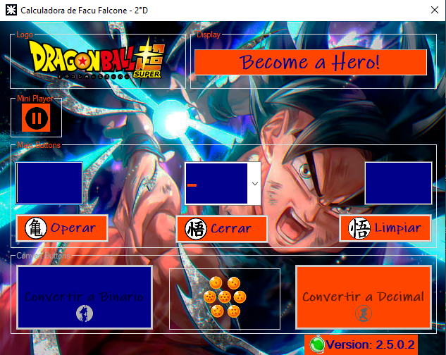

<table>
  <tr>
  <td><a href="https://github.com/caidevOficial/tp_laboratorio_2/" target="_blank"></td>
  <td></td>
  <td></td>
  </tr>
</table></br>

# TP1 - Calculator C#! [DBSuper Theme]

<table>
  <th><center>Sample</center></th>
  <tr>
  <td><center></td></center>
  </tr>
</table></br>

## Starting 🚀

_These instructions will allow you to get a copy of the project running on your local machine for development and testing purposes._

### Pre requirements 📋

_What things do you need to run the software and how to do it._

```
To run the TP's C#! [Windows], you'll need Linux (it's a joke, Windows!).
```

### Installation 🔧

_As simple as cloning and running the program ^^_

_What's more.._

```
You can clone, download as zip or forke!
```

## Built with Visual Studio Community [2019]🛠️

_Tools used to create these projects_

* [Visual Studio Community 2019](https://visualstudio.microsoft.com/thank-you-downloading-visual-studio/?sku=Community&rel=16) 
_in its version_:
```
[Version 16.9.3](MS_Framework version: 4.8.03761) - The IDE used in the Windows version to TP's C#! [Windows]!.
```

## Releases 📌

You can see the different versions or releases by clicking on -> [Releases](https://github.com/caidevOficial/tp_laboratorio_2/releases)


## License 📄

This project is under the License [MIT License] - look at the file [LICENSE.md](LICENSE) for details.


## Technologies used. 📌
|<a href="https://docs.microsoft.com/es-es/dotnet/csharp/">|<h3>C#</h3>|
|--------|----------|

---

## Where to find me: 🌎
|||
|------------|------------|
|🤴 Facu Falcone|Junior Developer|
||<center><a href="https://github.com/caidevOficial/">Github</a></center>|
||<a href="https://www.linkedin.com/in/facundo-falcone/">LinkedIn</a>|
||<a href="https://cafecito.app/caidevoficial/">CafecitoApp</a>|
---
⌨️ with ❤️ by [caidevOficial](https://github.com/caidevOficial) 😊
