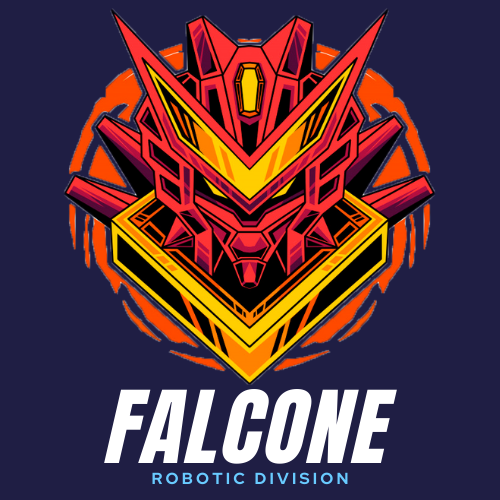
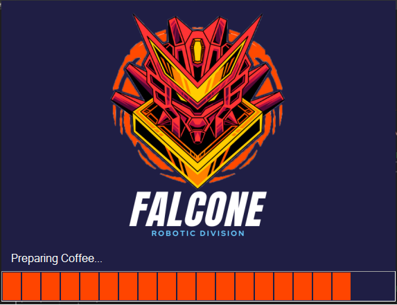
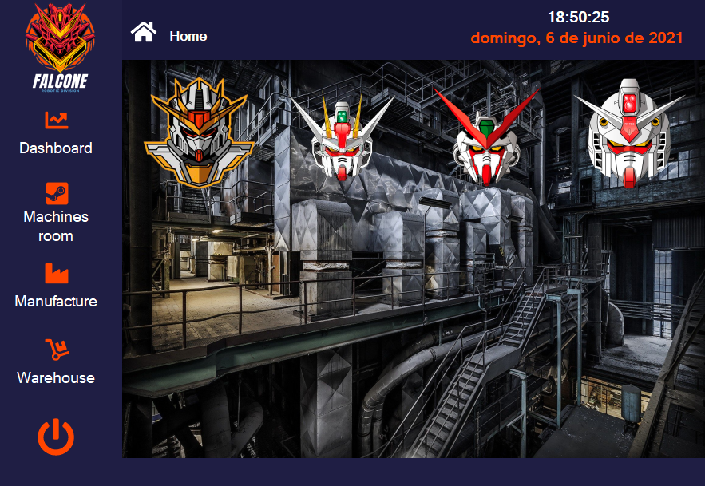
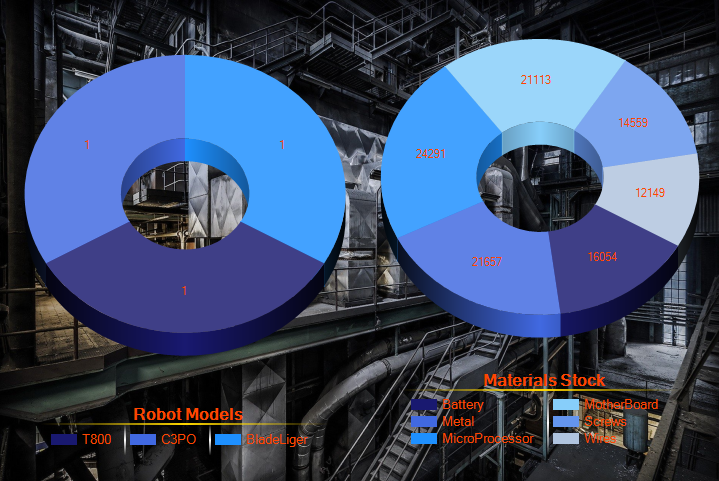

<table>
  <tr>
  <td><a href="https://github.com/caidevOficial/tp_laboratorio_2/" target="_blank"></td>
  <td></td>
  <td></td>
  </tr>
</table></br>

# TP3 - Factory C#! [Robots Theme]

<table>
  <th><center>Logo</center></th><th><center>Lobby</center></th>
  <tr>
    <td>
      <center>
        </center>
    </td>
    <td>
      <center>
        
      </center>
    </td>
  </tr>
  <th><center>Charts</center></th>
  <tr>
    <td>
      <center>
        
      </center>
    </td>
  </tr>
</table></br>

<details>
  <summary>:zap: GitHub Stats</summary>
    <br><br>
</details>

<details>
    <summary>:zap: Most Used Languages</summary>
    <br>
</details>

---

```C#
public static string ShowNewSkill() {
	StringBuilder message = new StringBuilder();
	message.AppendLine("Learning C#");
	message.AppendLine("the best i can!");
	
	return message.ToString();
}
```
---

## Technologies used. 📌
|<a href="https://docs.microsoft.com/es-es/dotnet/csharp/">|<h3>C#</h3>|
|--------|----------|

---

## License 📄
This project is under license \[MIT License\] - read the file [LICENSE.md](LICENSE) for details.

---

## Where to find me: 🌎

| ||
|:----:|:----:|
|🤴 Facu Falcone|<center>Junior Developer</center>|
||<center><a href="https://github.com/caidevOficial/"><center>Github</center></a></center>|
||<a href="https://www.linkedin.com/in/facundo-falcone/"><center>LinkedIn</center></a>|
||<a href="https://cafecito.app/caidevoficial/"><center>CafecitoApp</center></a>|
||<a href='https://ko-fi.com/P5P74JBOH' target='_blank'><center>Ko-Fi</center></a>|

---